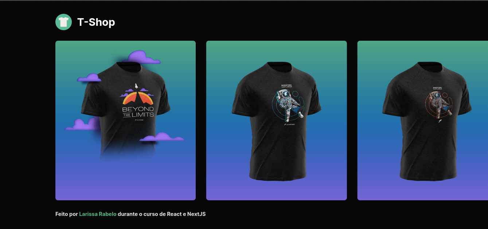
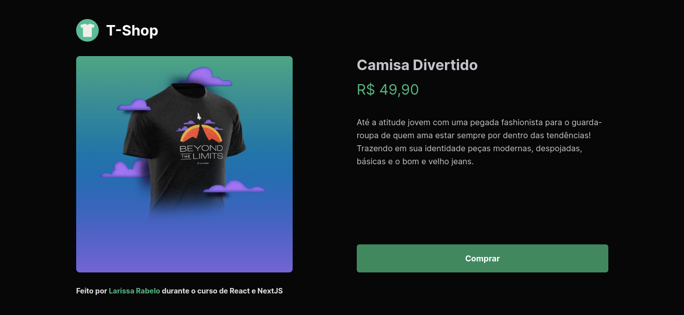
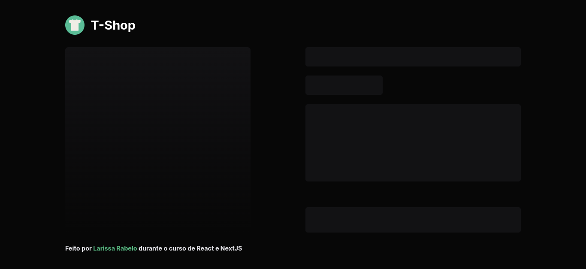

<div align="center">

  <h1>Fundamentos NextJS</h1>
  <p>
    Rocketseat · Formação Ignite · 2022
  </p>

<!-- Badges -->
<p>

</p>

<h4>
    <a href="https://rs-ignite-04-nextjs.vercel.app/" target="_blank" >Demo</a>
  <span> · </span>
    <a href="https://www.figma.com/file/verQWddgKkCKHcaSGLsUIG/Ignite-Shop-(Copy)?node-id=521%3A100&t=9tjN3PeQChGSByBW-0">Figma</a>
</h4>
</div>

<br />

## 💡 Projeto

Projeto completo baseado no desing definido no figma, usando StichesJS e aplicando conceitos de SPA (Single Page Application) SSR (Server Side Render) e SSG (Server Side Generation).


<!-- [Versão em português](./README-ptbr.md) -->

## 🎯 Objetivos

Por meio deste projeto, foi possível aprender os fundamentos do NextJS, como:

- [x] Criar uma aplicação do zero com NextJS
- [x] Utilizar o conceito de SPA (Single Page Application)
- [x] Utilizar o conceito de SSR (Server Side Render)
- [x] Utilizar o conceito de SSG (Server Side Generation)
- [x] Utilizar o conceito de Static Site Generation
- [x] Utilizar o conceito de Client Side Rendering

## 🥳 Aplicação

### Preview · [DEMO](https://www.figma.com/file/6xrdqvBpvBhY0IXPyDkspc/Design-System?node-id=0%3A1)

<p align="center">
  
  
  
</p>

## 💻 Feito com

[](https://developer.mozilla.org/pt-BR/docs/Web/JavaScript)
[](https://www.typescriptlang.org/)
[](https://pt-br.reactjs.org/)
[](https://developer.mozilla.org/pt-BR/docs/Web/CSS)
[](https://vercel.com/)

## 🛠️ Ferramentas

[](https://www.figma.com/)
[](https://code.visualstudio.com/)
[](https://pop.system76.com/)

## 🦸‍♂️ Tecnologias de suporte

- [StitchesJS](https://stitches.dev/docs/introduction)

## 🚀 Execute o projeto

Clone o projeto

Vá para a raiz do diretório

Instale as dependências

```bash
  pnpm install
```

Inicie o ambiente de desenvolvimento

```bash
  pnpm run dev
```

<p align="center">Copyright 2022 ☕<a href="https://github.com/laripeanuts"> laripeanuts</a></p>
